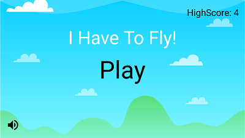
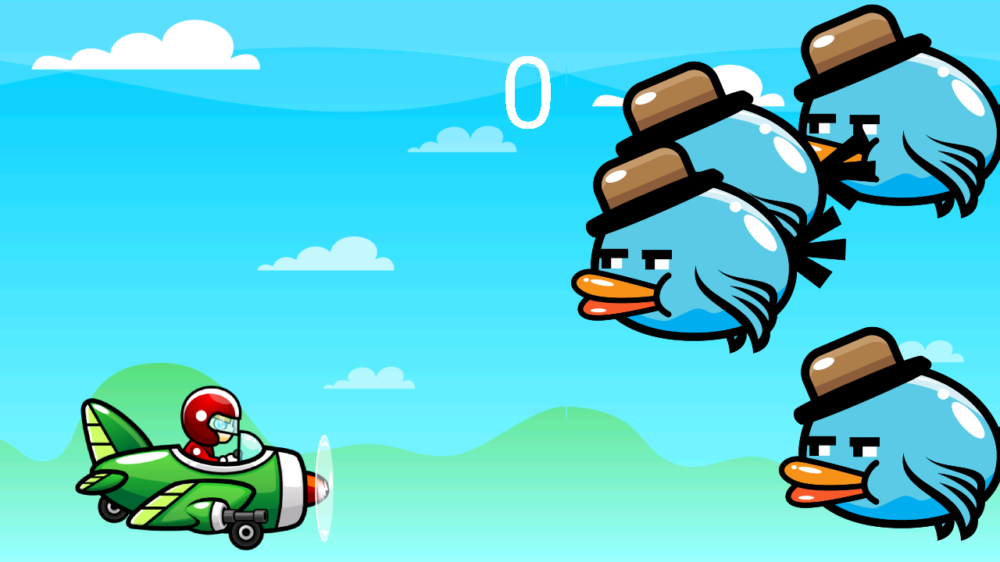
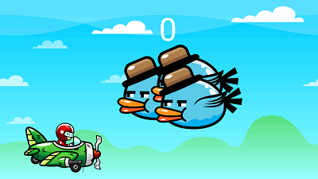
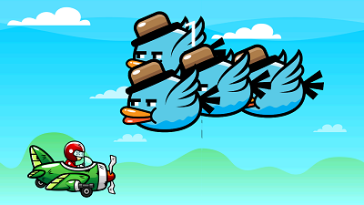

# 2D Game Application
Simple am android application of shooting bird game in java language for the childrens.
***

# Setting up the project
Step 1 : Fork, Clone and Remote\
Step 2 : Open  aproject in android studio
***

# Screenshots of the application

***
# Contributing
Get started with this simple and easy to follow project.
